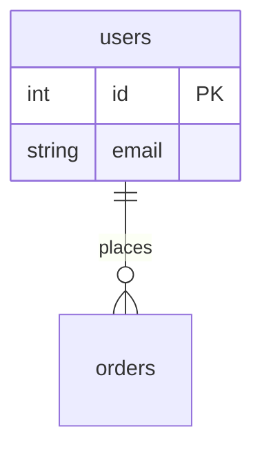

# CLAUDE.md - PostgreSQL Playground Development Guide

> **Last Updated**: 2025-11-17
>
> This document provides AI assistants with comprehensive knowledge of the PostgreSQL Playground codebase, including architecture, conventions, and development workflows.

## Table of Contents

1. [Project Overview](#project-overview)
2. [Tech Stack](#tech-stack)
3. [Directory Structure](#directory-structure)
4. [Architecture Patterns](#architecture-patterns)
5. [Development Workflows](#development-workflows)
6. [Code Conventions](#code-conventions)
7. [State Management](#state-management)
8. [Component Patterns](#component-patterns)
9. [Database Integration](#database-integration)
10. [Quality & Testing](#quality--testing)
11. [Git Conventions](#git-conventions)
12. [Key Files Reference](#key-files-reference)

---

## Project Overview

**PostgreSQL Playground** is a client-side PostgreSQL learning environment powered by PGLite (WASM port of PostgreSQL). The entire application runs in the browser with no server required, using IndexedDB for persistent storage.

### Key Features
- **Query Playground**: SQL editor with Monaco, result grid with Glide Data Grid
- **ERD Schema Generator**: Automatic entity relationship diagrams using Mermaid
- **Query History**: Timeline of executed queries
- **Persistent Data**: All data stored locally in IndexedDB
- **Mobile Responsive**: Adaptive UI for desktop and mobile
- **Sample Databases**: Pre-built datasets (orders, schools) for learning

### Philosophy
- **Privacy-first**: All processing happens client-side
- **No login required**: Fully offline-capable
- **Educational tool**: Learn PostgreSQL without setup complexity

---

## Tech Stack

| Category | Technology | Version | Purpose |
|----------|-----------|---------|---------|
| **Framework** | React | 18.3.1 | UI library |
| **Language** | TypeScript | 5.7.2 | Type-safe development |
| **Build Tool** | Vite | 6.0.1 | Fast bundler & dev server |
| **State** | Zustand | 5.0.1 | Lightweight state management |
| **Immutability** | Immer | 10.1.1 | Immutable state updates |
| **Database** | PGLite | 0.2.14 | PostgreSQL WASM |
| **Styling** | Tailwind CSS | 3.4.15 | Utility-first CSS |
| **UI Components** | Radix UI | Latest | Headless accessible primitives |
| **Code Editor** | Monaco Editor | 4.6.0 | SQL syntax highlighting |
| **Data Grid** | Glide Data Grid | 6.0.3 | High-performance table display |
| **Diagrams** | Mermaid | 11.4.1 | ERD generation |
| **Storage** | idb-keyval | 6.2.1 | IndexedDB wrapper |
| **Linter** | Biome | 1.9.4 | Fast linting & formatting |
| **Icons** | Tabler Icons | 3.23.0 | Icon set |
| **Toasts** | Sonner | 1.7.0 | Toast notifications |

---

## Directory Structure

```
pg/
├── src/
│   ├── app.tsx                          # Main app component with tab layout
│   ├── main.tsx                         # React entry point
│   ├── stores.ts                        # Zustand state management
│   │
│   ├── components/
│   │   ├── hooks/                       # Custom React hooks
│   │   │   ├── use-dark-mode.tsx        # Dark/light theme toggle
│   │   │   ├── use-form-state.tsx       # Form validation & state
│   │   │   ├── use-is-desktop.tsx       # Responsive breakpoint detection
│   │   │   ├── use-media-query.tsx      # Media query hook
│   │   │   └── use-copy.tsx             # Clipboard copy utility
│   │   │
│   │   ├── ui/                          # Shadcn/ui components (24+)
│   │   │   ├── button.tsx               # CVA-based button variants
│   │   │   ├── data-viewer.tsx          # Glide Data Grid wrapper
│   │   │   ├── code-editor.tsx          # Monaco editor wrapper
│   │   │   ├── modals.tsx               # Modal/Drawer Zustand system
│   │   │   └── [other Radix components]
│   │   │
│   │   ├── layouts/
│   │   │   ├── container.tsx            # Main layout wrapper
│   │   │   ├── header.tsx               # Header with logo & controls
│   │   │   ├── navigation.tsx           # Vertical/horizontal tabs
│   │   │   └── theme-switcher.tsx       # Dark mode toggle
│   │   │
│   │   └── interfaces/                  # Feature screens
│   │       ├── query-playground/        # Main SQL editor
│   │       ├── schema-erd.tsx           # ERD viewer
│   │       ├── schema-tree.tsx          # Schema browser
│   │       ├── query-history.tsx        # Query timeline
│   │       └── database-setup/          # DB CRUD operations
│   │
│   ├── postgres/
│   │   ├── setup.ts                     # Schema extraction & ERD generation
│   │   └── sample-data/                 # Sample databases (.sql files)
│   │
│   ├── utils/
│   │   ├── idb.ts                       # IndexedDB Zustand persistence
│   │   ├── postgres.ts                  # Query result transformers
│   │   └── classnames.ts                # Tailwind utilities (cn, etc.)
│   │
│   └── styles/
│       ├── globals.css                  # Global styles & CSS variables
│       └── datawan-ui.ts                # Tailwind preset with tokens
│
├── public/                               # Static assets
├── package.json                          # Dependencies & scripts
├── tsconfig.json                         # TypeScript config
├── vite.config.ts                        # Vite bundler config
├── tailwind.config.ts                    # Tailwind CSS config
├── biome.json                            # Biome linter/formatter
├── components.json                       # Shadcn CLI config
└── index.html                            # HTML entry point
```

---

## Architecture Patterns

### 1. Feature-Based Organization

Features live in `src/components/interfaces/`:
- **query-playground**: SQL editor with resizable panels
- **schema-erd**: Mermaid ER diagram viewer
- **query-history**: Timeline of executed queries
- **database-setup**: Database CRUD operations

### 2. Component Hierarchy

```
<App>
  └── <Header> + <Navigation> + <TabContent>
      ├── <QueryPlayground>
      │   └── <ResizablePanelGroup>
      │       ├── <SchemaTree>
      │       └── <CodeEditor> + <DataViewer>
      ├── <QueryHistory>
      └── <SchemaERD>
          ├── <SchemaTree>
          └── <Mermaid> (with zoom/pan/export)
```

### 3. Layer Separation

| Layer | Purpose | Location |
|-------|---------|----------|
| **State** | Global store | `stores.ts` |
| **Features** | App screens | `components/interfaces/` |
| **UI** | Reusable components | `components/ui/` |
| **Hooks** | Logic abstraction | `components/hooks/` |
| **Utils** | Helpers | `utils/` |
| **Database** | PGLite integration | `postgres/` |

### 4. Responsive Design Strategy

- **Desktop**: Resizable panels, vertical sidebar, inline modals
- **Mobile**: Horizontal tabs, drawer modals, collapsed schema
- Uses `useIsDesktop()` hook for breakpoint detection (768px)

---

## Development Workflows

### Setup

```bash
# Install dependencies (uses pnpm)
pnpm install

# Start dev server
pnpm dev

# Build for production
pnpm build

# Preview production build
pnpm preview

# Lint & format code
pnpm lint
```

### Adding New Components

1. **UI Components** (reusable):
   - Add to `src/components/ui/`
   - Follow Shadcn/ui patterns
   - Use CVA for variants if needed
   - Export as named export

2. **Feature Components** (screens):
   - Add to `src/components/interfaces/`
   - Create folder if multi-file
   - Connect to Zustand store for state

3. **Hooks**:
   - Add to `src/components/hooks/`
   - Prefix with `use*`
   - Make generic where possible

### Adding New Database Features

1. **Schema Queries**: Modify `postgres/setup.ts`
2. **Result Transformation**: Update `utils/postgres.ts`
3. **Sample Data**: Add `.sql` file to `postgres/sample-data/`

### Path Aliases

Use `@/` for all imports:
```typescript
import { Button } from "@/components/ui/button";
import { useDBStore } from "@/stores";
```

---

## Code Conventions

### TypeScript

- **Strict mode enabled**: `noUnusedLocals`, `noUnusedParameters`
- **No `any`**: Use explicit types or `unknown`
- **Interface over type**: For object shapes
- **Const assertions**: For literal types

```typescript
// Good
interface User {
  id: string;
  name: string;
}

const STATUSES = ["pending", "active"] as const;
type Status = typeof STATUSES[number];

// Bad
type User = {  // Use interface instead
  id: any;     // Use explicit type
}
```

### Naming Conventions

- **Components**: PascalCase (`QueryPlayground.tsx`)
- **Hooks**: camelCase with `use` prefix (`useDarkMode`)
- **Utils**: camelCase (`postgresTransformer`)
- **Constants**: UPPER_SNAKE_CASE (`MAX_QUERY_LENGTH`)
- **Files**: kebab-case matching component name

### React Patterns

```typescript
// Functional components with explicit types
export function Button({ children, ...props }: ButtonProps) {
  return <button {...props}>{children}</button>;
}

// Hooks at top, early returns
function Component() {
  const store = useDBStore();
  const isDesktop = useIsDesktop();

  if (!store.active) return null;

  return <div>...</div>;
}

// Destructure props, spread rest
function Input({ label, error, ...inputProps }: InputProps) {
  return (
    <div>
      <label>{label}</label>
      <input {...inputProps} />
      {error && <span>{error}</span>}
    </div>
  );
}
```

### Styling Conventions

- **Tailwind-first**: Use utility classes
- **cn() helper**: Merge classes with `clsx` + `tailwind-merge`
- **CVA for variants**: Button, Badge, etc.
- **No inline styles**: Use Tailwind or CSS variables

```typescript
import { cn } from "@/utils/classnames";

<div className={cn(
  "rounded-lg border p-4",
  isActive && "bg-primary text-primary-foreground"
)} />
```

### Biome Formatting

- **Indent**: 2 spaces
- **Line width**: 80 characters
- **Semicolons**: Required
- **Quotes**: Double quotes
- **Trailing commas**: ES5 style
- **No console.log**: Use toast notifications instead

---

## State Management

### Zustand Store (`stores.ts`)

```typescript
interface DBStore {
  // State
  active: Connection | null;           // Current database
  databases: Record<string, Database>; // All databases

  // Actions
  create: (data) => Promise<void>;     // Create new DB
  connect: (name) => Promise<void>;    // Switch DB
  execute: (query) => Promise<void>;   // Run SQL
  import: (key) => Promise<void>;      // Load sample data
  remove: (name) => Promise<void>;     // Delete DB
  update: (name, meta) => void;        // Update metadata
  reload: () => Promise<void>;         // Refresh schema
}
```

### Usage Patterns

```typescript
// Read state
const active = useDBStore((state) => state.active);
const databases = useDBStore((state) => state.databases);

// Call actions
const execute = useDBStore((state) => state.execute);
await execute("SELECT * FROM users");

// Outside React components
const result = await useDBStore.getState().execute(query);

// Update with Immer (mutable draft)
useDBStore.setState((state) => {
  state.databases[name].query = newQuery;
  state.databases[name].history.push(entry);
});
```

### Persistence

- **Storage**: IndexedDB via `zustandIDBStorage`
- **Persisted**: `databases` field only
- **Not persisted**: `active` connection (reconnects on load)
- **Key**: `"datawan-pg-databases"`

---

## Component Patterns

### 1. Radix UI Primitives

Use unstyled primitives from Radix, style with Tailwind:

```typescript
import * as Dialog from "@radix-ui/react-dialog";

export function MyDialog() {
  return (
    <Dialog.Root>
      <Dialog.Trigger asChild>
        <Button>Open</Button>
      </Dialog.Trigger>
      <Dialog.Portal>
        <Dialog.Overlay className="fixed inset-0 bg-black/50" />
        <Dialog.Content className="fixed left-1/2 top-1/2...">
          {/* Content */}
        </Dialog.Content>
      </Dialog.Portal>
    </Dialog.Root>
  );
}
```

### 2. CVA (Class Variance Authority)

Define variants for components:

```typescript
import { cva } from "class-variance-authority";

const buttonVariants = cva(
  "inline-flex items-center justify-center rounded-md",
  {
    variants: {
      variant: {
        default: "bg-primary text-primary-foreground",
        outline: "border border-input bg-background",
        ghost: "hover:bg-accent hover:text-accent-foreground",
      },
      size: {
        sm: "h-9 px-3",
        md: "h-10 px-4",
        lg: "h-11 px-8",
      },
    },
    defaultVariants: {
      variant: "default",
      size: "md",
    },
  }
);
```

### 3. Modal System (Zustand-based)

Stack-based modal management:

```typescript
import { modal } from "@/components/ui/modals";

// Open modal
modal.open({
  title: "Confirm Action",
  children: <p>Are you sure?</p>,
});

// Confirmation modal
modal.openConfirmModal({
  title: "Delete Database",
  children: <p>This action cannot be undone.</p>,
  onConfirm: async () => {
    await deleteDB();
  },
  closeOnConfirm: true,
});

// Close
modal.close();      // Close top modal
modal.closeAll();   // Close all modals
```

### 4. Form State Hook

Generic form validation:

```typescript
import { useFormState } from "@/components/hooks/use-form-state";

function MyForm() {
  const { values, errors, handleChange, handleSubmit } = useFormState({
    initialValues: { name: "", email: "" },
    validate: (values) => {
      const errors: Record<string, string> = {};
      if (!values.name) errors.name = "Required";
      if (!values.email.includes("@")) errors.email = "Invalid email";
      return errors;
    },
    onSubmit: async (values) => {
      await createUser(values);
    },
  });

  return (
    <form onSubmit={handleSubmit}>
      <input name="name" value={values.name} onChange={handleChange} />
      {errors.name && <span>{errors.name}</span>}
    </form>
  );
}
```

### 5. Responsive Components

Use hooks for conditional rendering:

```typescript
import { useIsDesktop } from "@/components/hooks/use-is-desktop";

function MyComponent() {
  const isDesktop = useIsDesktop();

  return isDesktop ? (
    <ResizablePanelGroup>
      <SchemaTree />
      <Editor />
    </ResizablePanelGroup>
  ) : (
    <Tabs>
      <TabsList>
        <TabsTrigger value="editor">Editor</TabsTrigger>
        <TabsTrigger value="schema">Schema</TabsTrigger>
      </TabsList>
    </Tabs>
  );
}
```

---

## Database Integration

### PGLite Connection

```typescript
import { PGlite } from "@electric-sql/pglite";

// Create instance
const pg = await PGlite.create();

// Execute query
const result = await pg.exec(query);

// Access results
result[0].rows;     // Array of row objects
result[0].fields;   // Column metadata
result[0].affectedRows;  // For INSERT/UPDATE/DELETE
```

### Schema Extraction (`postgres/setup.ts`)

**Function**: `getDatabaseSchema(pg: PGlite)`

Queries:
- `information_schema.tables`
- `information_schema.columns`

Returns:
```typescript
interface DatabaseSchema {
  schema_name: string;
  table_name: string;
  table_type: "BASE TABLE" | "VIEW";
  columns: {
    column_name: string;
    data_type: string;
  }[];
}
```

### ERD Generation (`postgres/setup.ts`)

**Function**: `generateMermaidErd(pg: PGlite)`

Queries:
- `pg_class`, `pg_attribute`, `pg_constraint`
- Extracts tables, columns, relationships

Returns: Mermaid ER diagram string



### Result Transformation (`utils/postgres.ts`)

**Function**: `postgresTransformer(results: Results[])`

Maps PostgreSQL types to UI types:
- `uuid` → `"id"`
- `int2/int4/int8` → `"number"`
- `bool` → `"string"`
- Objects/Arrays → JSON serialized

Returns: `DataGridValue<Cell>[]` for Glide Data Grid

---

## Quality & Testing

### Biome Linting

Strict rules enabled:
- **No console.log**: Use Sonner toast instead
- **No explicit `any`**: Use proper types
- **No unused variables**: Clean up imports
- **Sorted CSS classes**: Tailwind class ordering
- **No debugger statements**

Run linter:
```bash
pnpm lint  # Auto-fix issues
```

### TypeScript Checks

```bash
# Type checking (during build)
pnpm build
```

### Code Quality Checklist

Before committing:
- [ ] No console.log statements
- [ ] No TypeScript errors
- [ ] Biome linting passes
- [ ] No unused imports/variables
- [ ] Tailwind classes sorted
- [ ] Responsive design tested (desktop + mobile)
- [ ] Dark mode tested

---

## Git Conventions

### Commit Message Format

```
<type>: <description>

Examples:
feat: add export to CSV functionality
chore: upgrade dependencies to latest versions
fix: resolve schema tree collapse issue
refactor: extract query logic to custom hook
docs: update README with new features
```

### Commit Types

- **feat**: New feature
- **fix**: Bug fix
- **chore**: Maintenance (deps, config, tooling)
- **refactor**: Code restructuring without behavior change
- **docs**: Documentation updates
- **style**: Formatting, whitespace (no logic change)

### Branch Strategy

- **Main branch**: Stable production code
- **Feature branches**: `claude/*` prefix for AI-assisted development
- Always create PRs for review

### Pre-commit Checklist

1. Run `pnpm lint` to fix linting issues
2. Verify no TypeScript errors
3. Test in both light and dark mode
4. Test responsive behavior (desktop + mobile)
5. Clear browser console of errors

---

## Key Files Reference

### Configuration Files

| File | Purpose | Key Settings |
|------|---------|--------------|
| `package.json` | Dependencies & scripts | React 18, Zustand 5, PGLite 0.2 |
| `tsconfig.json` | TypeScript config | Strict mode, `@/*` alias |
| `vite.config.ts` | Build config | React plugin, `.sql` assets |
| `tailwind.config.ts` | Styling config | Datawan UI preset |
| `biome.json` | Linting/formatting | 2 spaces, 80 chars, no console |
| `components.json` | Shadcn config | Neutral theme, tsx |

### Core Application Files

| File | Purpose |
|------|---------|
| `src/main.tsx` | React entry point, renders App |
| `src/app.tsx` | Main app with tab navigation |
| `src/stores.ts` | Zustand store definition |
| `src/styles/globals.css` | CSS variables, Tailwind imports |
| `src/styles/datawan-ui.ts` | Design tokens preset |
| `src/postgres/setup.ts` | Schema extraction & ERD |
| `src/utils/idb.ts` | IndexedDB persistence |
| `src/utils/postgres.ts` | Result transformers |
| `src/utils/classnames.ts` | Tailwind helpers |

### UI Component Library

All in `src/components/ui/`:
- `button.tsx` - CVA button with variants
- `data-viewer.tsx` - Glide Data Grid wrapper
- `code-editor.tsx` - Monaco editor wrapper
- `modals.tsx` - Modal/Drawer system
- `dialog.tsx`, `drawer.tsx` - Radix primitives
- Plus 15+ more Shadcn components

---

## Development Tips for AI Assistants

### When Adding Features

1. **Check existing patterns first**: Look at similar features
2. **Use TypeScript strictly**: No `any`, explicit types
3. **Follow responsive design**: Test desktop + mobile
4. **Update Zustand store**: Add state/actions if needed
5. **Use existing UI components**: Don't reinvent primitives
6. **Keep bundle size small**: Tree-shake unused code

### When Debugging

1. **Check Biome output**: `pnpm lint` shows issues
2. **TypeScript errors**: Build fails show type issues
3. **Console errors**: Should be none in production
4. **IndexedDB**: Check Application tab in DevTools
5. **PGLite state**: Inspect Zustand store devtools

### Common Tasks

**Add new sample database**:
1. Create `.sql` file in `postgres/sample-data/`
2. Add entry to `SAMPLE_DATA` array in `postgres/sample-data/index.tsx`
3. Update type: `SampleDataKey = "orders" | "schools" | "your-new-db"`

**Add new UI component**:
1. Check if Shadcn has it: https://ui.shadcn.com/
2. Create in `components/ui/` following existing patterns
3. Use Radix UI if stateful (Dialog, Accordion, etc.)
4. Style with Tailwind, use CVA for variants

**Add new route/tab**:
1. Create interface in `components/interfaces/`
2. Add tab to Navigation component
3. Add TabsContent in App component
4. Update routing logic

**Modify schema extraction**:
1. Edit `postgres/setup.ts`
2. Test with multiple databases
3. Ensure ERD generation still works

---

## Troubleshooting

### Build Errors

- **"Cannot find module '@/...'"**: Check `tsconfig.json` paths
- **Type errors**: Run `pnpm build` to see all errors
- **Biome errors**: Run `pnpm lint` to auto-fix

### Runtime Issues

- **PGLite not loading**: Check `optimizeDeps.exclude` in `vite.config.ts`
- **IndexedDB errors**: Clear browser data, check quota
- **Modal not closing**: Verify Zustand modal state
- **Schema not updating**: Call `reload()` action

### Styling Issues

- **Dark mode broken**: Check CSS variables in `globals.css`
- **Responsive layout**: Test with DevTools device toolbar
- **Tailwind not applying**: Run dev server, check for typos

---

## Additional Resources

- **PGLite Docs**: https://github.com/electric-sql/pglite
- **Zustand Docs**: https://docs.pmnd.rs/zustand
- **Radix UI**: https://www.radix-ui.com/
- **Shadcn UI**: https://ui.shadcn.com/
- **Tailwind CSS**: https://tailwindcss.com/
- **Mermaid Diagrams**: https://mermaid.js.org/

---

**Questions or Issues?** Check existing code patterns first, then consult this guide. Always maintain the established conventions and architectural patterns described above.
